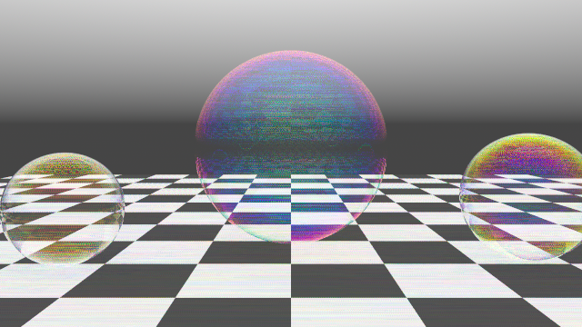
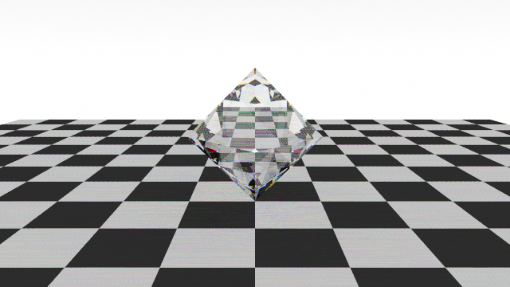
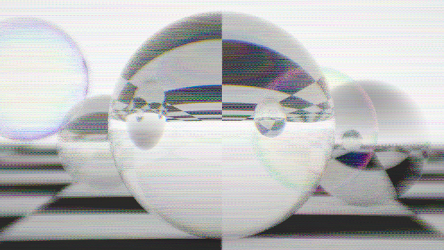
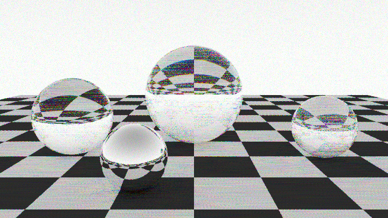
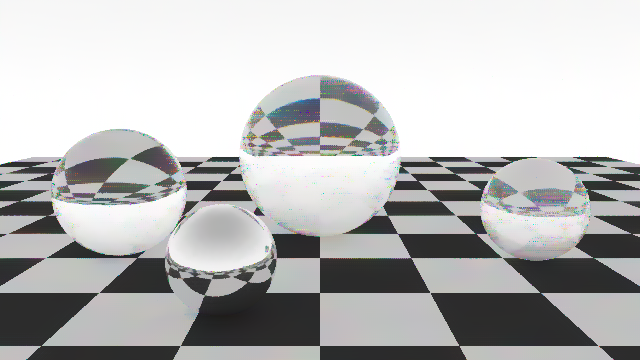

# Prism

A spectral light simulator and lens designer written in Rust. Prism traces one
wavelength of light at a time (380 to 780 nm) instead of faking colour with RGB,
so dispersion comes straight from the physics: glass bends blue light more than
red, and a prism or a diamond splits white light with no special-casing.

Glass spheres (SF11, diamond, N-BK7) and a mirror ball over a checkerboard,
rendered with `prism demo`.

## Status

| Stage | State |
|---|---|
| Vector maths, rays, spheres, triangles, SAH BVH | done |
| Spectral colour (CIE fit), Sellmeier glass catalogue, Fresnel | done |
| Path tracer, multi-threaded renderer, PNG writer, demo scene | done |
| Lens prescriptions, paraxial analysis, real ray tracing, spot diagrams | done |
| Lens optimizer (damped least squares) | done |
| Distortion, field curvature, geometric MTF | done |
| Thin-film interference (soap bubbles) | done |
| Scene description files, OBJ meshes, `prism render` | done |
| Edge-avoiding wavelet denoiser (guided by albedo, normal, depth) | done |
| Python tools: PNG codec, image metrics, independent paraxial cross-check, denoiser benchmark | done |
| Learned denoiser (Python training) | planned |
| WebAssembly API (render scene, analyze lens, optimize lens) | done |
| Web lens and scene editor (Vite, React, engine in a Web Worker) | done |
| Render through a real lens (depth of field, aberrations, vignetting, bokeh) | done |

## Quick start

    cargo run --release -p prism-cli -- demo
    cargo run --release -p prism-cli -- demo --out docs/demo.png --width 1280 --height 720 --samples 128
    cargo run -q -p prism-cli -- info
    cargo run -q -p prism-cli -- analyze examples/doublet.lens
    cargo run -q -p prism-cli -- optimize examples/singlet.lens
    cargo run --release -q -p prism-cli -- render examples/gem.scene

## How it works

Each sample picks a random wavelength and follows one path through the scene.
Glass chooses reflection or refraction using the Fresnel equations, with the
refractive index computed per wavelength from a Sellmeier equation. The radiance
of every sample is weighted by the CIE colour matching functions, summed into
XYZ, white balanced, and converted to sRGB.

## Layout

| Path | Purpose |
|---|---|
| `crates/prism-core` | The engine (modules below) |
| `crates/prism-cli` | The `prism` command line tool |
| `crates/prism-wasm` | WebAssembly bindings for the browser |
| `web/` | React + TypeScript viewer |
| `python/` | Denoiser training and analysis tools |

Engine modules: `math` (vectors, rays, boxes, seeded RNG), `geometry`, `bvh`,
`color`, `glass`, `material`, `camera`, `scene`, `integrator`, `film`, `png`,
`lens`, `analysis`, `optimize`, `obj`, `scenefile`, `thinfilm`, `report`, `features`, `denoise`, `lenscam`, `render`, `demo`.

## Scene files

    sky 1.0 0.45
    camera 0 2.2 6  0 0.9 0  38
    image 640 360 96
    floor 8 0.85 0.04
    mesh octahedron.obj 1.0 0 1.0 0 glass DIAMOND

One directive per line, `#` starts a comment, and y is up. Directives: `sky`,
`camera` (required), `image`, `floor` (a checkerboard on y = 0), `sphere`,
`triangle`, and `mesh` (a Wavefront OBJ file, found relative to the scene file).
A material is `diffuse <r>`, `mirror <r>` or `glass <name>`, where the name is
one of N-BK7, FUSED-SILICA, F2, SF11, SAPPHIRE, DIAMOND or WATER. A glass mesh
must be closed, with faces wound counter-clockwise as seen from outside.
`thinfilm <index> <nm>` is an infinitely thin film such as a soap bubble wall.
Its colour comes from multiple-beam interference, so it depends on the film
thickness and on the viewing angle (xamples/bubble.scene).

    prism render examples/gem.scene --out docs/gem.png

A diamond octahedron over a checkerboard, rendered with `prism render`.
## Lens analysis

A lens prescription is a text file with one surface per line: radius, thickness
to the next surface, the glass behind the surface, and an optional
semi-aperture. Use `flat` for a plane and `air` for no glass. Distances are in
millimetres and light travels in the +z direction.

    # radius  thickness  glass  aperture
    44.78     4.0        N-BK7  12.5
    -44.78    2.5        F2     12.5
    -812      95.0       air    12.5

`prism analyze` prints the paraxial focal length and back focal distance, then
the RMS spot radius at 450, 550 and 650 nm on a plane placed at the paraxial
focus. The paraxial maths is tested against the thick-lens equation, and the
real ray tracer is tested against the paraxial focus.

It also reports distortion and the tangential and sagittal best focus at 0, 5 and
10 degrees, and the geometric MTF on axis. The MTF is the Fourier transform of
the traced ray positions, so it ignores diffraction and is optimistic for small
apertures.
## Lens optimization

    prism optimize examples/singlet.lens --out singlet-optimized.lens

`prism optimize` adjusts surface curvatures and the image distance with damped
least squares (Levenberg-Marquardt). The merit function is the spot size at 450,
550 and 650 nm measured from the d-line chief ray, plus a penalty that holds the
effective focal length at its starting value (or at `--target-efl`). Use
`--vary 0,2` to restrict which surfaces change and `--fields 0,5` to optimize
off-axis as well. The result is printed as a prescription that `prism analyze`
can read back.

## WebAssembly

    rustup target add wasm32-unknown-unknown
    cargo build -p prism-wasm --target wasm32-unknown-unknown --release

`crates/prism-wasm` exports `render_scene(text, width, height, samples)` (RGBA
bytes for a canvas), `analyze_lens(text, pupil, field)`, `optimize_lens(text,
iterations)`, `lens_drawing(...)`, `version()` and `check_wavelength(nm)`. Browsers cannot spawn
threads from plain WebAssembly, so the renderer uses a single thread there; the
image is identical to the multi-threaded one.
## Web editor

    powershell -File scripts/build-wasm.ps1
    cd web
    npm install
    npm run dev

The Lens tab draws a cross-section with rays traced through the real lens at 450,
550 and 650 nm. The image plane sits at the d-line focus, so chromatic aberration
is visible as the three colours missing the focus by different amounts. It also
shows the analysis report and can run the optimizer. The Scene tab renders scene
files. All engine calls run in a Web Worker, so the page stays responsive.

`web/src/wasm` holds the generated WebAssembly bindings and is committed, so CI
and Docker builds need no wasm toolchain. Run `scripts/build-wasm.ps1` again after
changing the exported functions in `crates/prism-wasm`.
## Rendering through a lens

    prism render examples/lens.scene --lens examples/doublet.lens --focus 5.5 --out docs/lens-camera.png

With `--lens` the camera is no longer a pinhole. Each ray starts on a sensor
behind the lens, aims at a random point of the lens's rear aperture, and is
traced through every surface of the prescription at the wavelength of that
sample. Depth of field, chromatic aberration, vignetting from blocked rays and
out-of-focus highlights (bokeh) come out of the optics, and every ray is
weighted by cos^4 of its angle to the axis, which gives the natural falloff
towards the corners. Scene units are metres and the lens is in millimetres.

`--focus` is the focus distance in metres (default 5), `--sensor-width` is in
millimetres (default 36), and the `camera` line of the scene file gives only the
position and direction, because the field of view now comes from the lens and
the sensor. The last surface of the prescription needs a finite aperture, and
`--denoise` cannot be combined with `--lens`. The tests check the image
orientation, that rays retrace their path through the reversed lens, that the
focus distance follows the thin lens equation, and that the focus control
changes sharpness.
## Denoising

Low sample counts are noisy, partly because every sample also picks a random
wavelength. `prism render --denoise` filters the image with an edge-avoiding
a-trous wavelet filter. It is guided by noise-free albedo, normal and depth
buffers, so object edges and checkerboard edges stay sharp while the noise is
averaged away. The web editor has a Denoise switch that does the same.

    prism render examples/demo.scene --samples 16 --out docs/noisy-16spp.png
    prism render examples/demo.scene --samples 16 --denoise --out docs/denoised-16spp.png

## Python tools

    cd python
    python -m venv .venv
    .venv\Scripts\activate
    pip install -e ".[dev]"
    pytest
    prism-bench

The `prism_py` package has a dependency-free PNG codec, image metrics (MSE, PSNR
and SSIM), an independent paraxial lens calculator and a denoiser benchmark. The
calculator re-implements the Sellmeier glass model and the paraxial ray trace in
Python, and the tests check that it agrees with the focal lengths and back focal
distances printed by the Rust `prism analyze`, so each side validates the other.
`prism-bench` renders a scene with the Rust tool at several sample counts, with
and without `--denoise`, and scores every image against a high-sample reference.
The results are in `docs/benchmarks.md`.
## Testing

Correctness is checked against known physics, not just against itself. A glass
sphere inside a uniform white sky must return exactly 1.0 at every wavelength
(energy conservation), a diffuse sphere in the same sky must return its
reflectance, glass indices must match manufacturer datasheets, and the BVH must
agree with brute force on 1000 random rays.

## Develop

    cargo fmt --all
    cargo clippy --workspace --all-targets -- -D warnings
    cargo test --workspace
    cd web; npm install; npm run build; npm test
    cd python; pip install -e ".[dev]"; pytest; ruff check .

## License

MIT