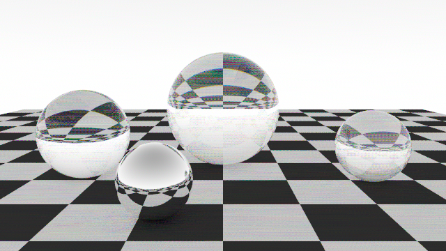

# Prism

A spectral light simulator and lens designer written in Rust. Prism traces one
wavelength of light at a time (380 to 780 nm) instead of faking colour with RGB,
so dispersion comes straight from the physics: glass bends blue light more than
red, and a prism or a diamond splits white light with no special-casing.

Glass spheres (SF11, diamond, N-BK7) and a mirror ball over a checkerboard,
rendered with `prism demo`.

## Status

| Stage | State |
|---|---|
| Vector maths, rays, spheres, triangles, SAH BVH | done |
| Spectral colour (CIE fit), Sellmeier glass catalogue, Fresnel | done |
| Path tracer, multi-threaded renderer, PNG writer, demo scene | done |
| Lens prescriptions and sequential ray tracing | next |
| Lens optimizer, spot diagrams, MTF | planned |
| Scene description language | planned |
| Denoiser (Python training, Rust inference) | planned |
| WebAssembly build and web lens editor | planned |

## Quick start

    cargo run --release -p prism-cli -- demo
    cargo run --release -p prism-cli -- demo --out docs/demo.png --width 1280 --height 720 --samples 128
    cargo run -q -p prism-cli -- info

## How it works

Each sample picks a random wavelength and follows one path through the scene.
Glass chooses reflection or refraction using the Fresnel equations, with the
refractive index computed per wavelength from a Sellmeier equation. The radiance
of every sample is weighted by the CIE colour matching functions, summed into
XYZ, white balanced, and converted to sRGB.

## Layout

| Path | Purpose |
|---|---|
| `crates/prism-core` | The engine (modules below) |
| `crates/prism-cli` | The `prism` command line tool |
| `crates/prism-wasm` | WebAssembly bindings for the browser |
| `web/` | React + TypeScript viewer |
| `python/` | Denoiser training and analysis tools |

Engine modules: `math` (vectors, rays, boxes, seeded RNG), `geometry`, `bvh`,
`color`, `glass`, `material`, `camera`, `scene`, `integrator`, `film`, `png`,
`render`, `demo`.

## Testing

Correctness is checked against known physics, not just against itself. A glass
sphere inside a uniform white sky must return exactly 1.0 at every wavelength
(energy conservation), a diffuse sphere in the same sky must return its
reflectance, glass indices must match manufacturer datasheets, and the BVH must
agree with brute force on 1000 random rays.

## Develop

    cargo fmt --all
    cargo clippy --workspace --all-targets -- -D warnings
    cargo test --workspace
    cd web; npm install; npm run build; npm test
    cd python; pip install -e ".[dev]"; pytest; ruff check .

## License

MIT